<div class="iz-hero">
  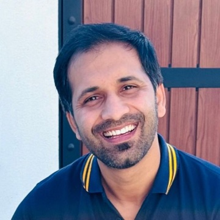
  <div class="iz-id">
    <p class="iz-name">Imtiaz Zahoor</p>
    <nav class="iz-social" aria-label="Contact"><a href="mailto:imtiazdvm@gmail.com">Email</a><a href="https://x.com/imtiazzhr">X</a><a href="https://www.instagram.com/imtiazzhr">Instagram</a><a href="https://www.facebook.com/imtiazzhr">Facebook</a><a href="./index.xml" data-router-ignore>RSS</a></nav>
    <p class="iz-sub">DVM · Equine and camel medicine, lameness and diagnostic imaging · Abu Dhabi</p>
    <nav class="iz-nav" aria-label="Sections"><a href="./essays/">Writing</a><a href="./projects">Projects</a><a href="./books/">Books</a><a href="./vet-notes/">Vet notes</a><a href="./now">Now</a><a href="./about">About</a></nav>
  </div>
</div>

Hi, 👋 Welcome to my writing and clinical notes.

I make a living treating animals, and write about the work, productivity, AI, and building things on the side. I’m also tinkering with AI, which I think could usher in a new era of personalized software—helping people build tools around their own needs, have more fun with technology, and discover new ways of getting things done.

For the clinical notes, I’ve spent about ten years in large-animal practice, mainly working with horses and camels, across Pakistan, Qatar, Oman, Saudi Arabia, and the UAE. I started these notes in 2019 to document my own cases and prepare for licensing exams. Since then, they’ve also helped many other veterinarians prepare for theirs.

I mostly write them for myself—a place to think, learn, and keep track of what I’ve seen. So some notes may be rough, incomplete, or confusing outside their original context. I keep revisiting and improving them, and if you spot something that could be better, I’d genuinely love to hear from you. [Email me](mailto:imtiazdvm@gmail.com).

## Writing

Essays on the work, productivity, philosophy and technology, plus a few practical guides.

### Essays

```base
filters:
  and:
    - file.inFolder("essays")
    - file.name != "index"
formulas:
  when: date(note.date).format("MMM YYYY")
views:
  - type: list
    name: Writing
    order:
      - file.name
      - formula.when
    sort:
      - property: date
        direction: DESC
```

## For veterinary professionals

Where to start in my clinical notes, whether you're preparing for a licensing exam or working up a case.

### Exams

- [[Important topics]]
- [[UAE Vet Exam]]
- [[Qatar GP Exam]]
- [[Preparation Strategy for interns|Preparation strategy for interns]]
- [[How to get your vet licence in the UAE and Qatar|Getting licensed in the UAE and Qatar]]

### Species

- [[Equine notes|Horses]]
- [[Camel Diseases|Camels]]
- [[Bovines|Cattle]]
- [[Sheep and goats]]
- [[Falcon diseases|Falcons]]

### Subjects

- [[Medicine]]
- [[Emergency care and fluid therapy]]
- [[Anesthesia overview|Anesthesia]]
- [[Clinical Pathology|Clinical pathology]]
- [[Diagnostic Imaging|Diagnostic imaging]]
- [[Equine and camel ultrasound]]
- [[Pharmacology notes|Pharmacology]]

### Diseases

- [[Laminitis]]
- [[Trypanosomiasis]]
- [[Ketosis]]
- [[Pregnancy Toxemia|Pregnancy toxemia]]
- [[vet-notes/diseases/index|All disease notes, A–Z →]]

## Books

A few of the books I've read. See [[books/index|all books]], with summaries and key insights.

- [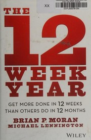](books/The%2012%20Week%20Year.md)
- [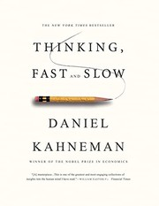](books/Thinking,%20Fast%20and%20Slow.md)
- [](books/Man's%20Search%20for%20Meaning.md)
- [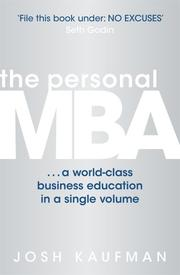](books/The%20Personal%20MBA.md)
- [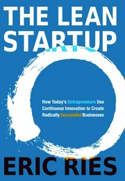](books/The%20Lean%20Startup.md)
- [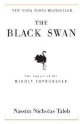](books/The%20Black%20Swan.md)
- [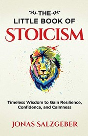](books/The%20Little%20Book%20of%20Stoicism.md)
- [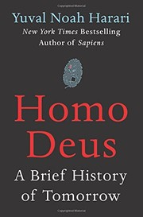](books/Homo%20Deus.md)
- [](books/The%204-Hour%20Workweek.md)
- [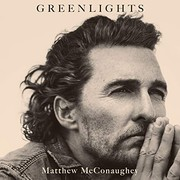](books/Greenlights.md)
- [](books/A%20Promised%20Land.md)
- [](books/As%20a%20Man%20Thinketh.md)
- [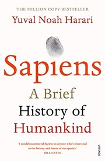](books/Sapiens.md)
- [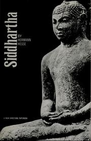](books/Siddhartha.md)
- [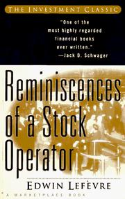](books/Reminiscences%20of%20a%20Stock%20Operator.md)
- [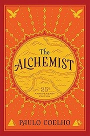](books/The%20Alchemist.md)
- [](books/The%20Forty%20Rules%20of%20Love.md)
- [](books/The%20Kite%20Runner.md)
- [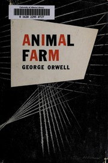](books/Animal%20Farm.md)
- [](books/To%20Kill%20a%20Mockingbird.md)
- [](books/Elon%20Musk.md)
- [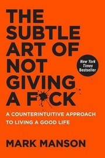](books/The%20Subtle%20Art%20of%20Not%20Giving%20a%20F-ck.md)
- [](books/Jinnah%20of%20Pakistan.md)
- [](books/Shahaab%20Nama.md)
